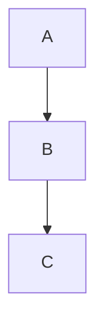

# FRKP-002 — Document Metadata Standard

---

## Document Information

| Item            | Value                      |
| --------------- | -------------------------- |
| Document ID     | FRKP-002                   |
| Document Name   | Document Metadata Standard |
| Version         | 1.0.0                      |
| Status          | Draft                      |
| Owner           | Project Lead               |
| Parent Document | FRKP-001                   |
| Created         | 2026-06-26                 |
| Last Updated    | 2026-06-26                 |

---

# 1. Purpose

본 문서는 Financial Risk Knowledge Platform(FRKP)에서 작성되는 모든 문서의 공통 메타데이터와 작성 형식을 정의한다.

모든 프로젝트 문서는 본 표준을 준수하여 작성한다.

---

# 2. Scope

본 표준은 다음 문서에 공통 적용한다.

* Governance
* Project Management
* Knowledge Base
* Formula Catalog
* Glossary
* Volumes
* Architecture Guide
* Appendix
* Reference Documents

---

# 3. Standard Document Structure

모든 문서는 다음 구조를 기본으로 한다.

```text
Document Title

Document Information

1. Purpose

2. ...

3. ...

...

Revision History
```

필요에 따라 장(Chapter)은 추가하거나 삭제할 수 있으나, 아래 항목은 반드시 포함한다.

* Document Title
* Document Information
* Purpose
* Revision History

---

# 4. Document Information

모든 문서는 문서 상단에 다음 정보를 포함한다.

| Item            | Required | Description |
| --------------- | -------- | ----------- |
| Document ID     | Yes      | 고유 문서 번호    |
| Document Name   | Yes      | 문서명         |
| Version         | Yes      | 문서 버전       |
| Status          | Yes      | 문서 상태       |
| Owner           | Yes      | 문서 책임자      |
| Parent Document | No       | 상위 문서       |
| Created         | Yes      | 최초 작성일      |
| Last Updated    | Yes      | 최종 수정일      |

---

# 5. Heading Standard

문서는 Markdown Heading을 사용한다.

예)

```markdown
# 1. Introduction

## 1.1 Background

### 1.1.1 Example
```

Heading 번호는 문서 내에서 순차적으로 관리한다.

---

# 6. Table Standard

메타데이터 및 구조화된 정보는 Markdown Table을 사용한다.

예)

```markdown
| Item | Value |
|------|-------|
| Version | 1.0.0 |
```

---

# 7. List Standard

일반 목록은 Bullet List를 사용한다.

```markdown
- Item A
- Item B
- Item C
```

순서가 중요한 경우 Number List를 사용한다.

```markdown
1. Step A
2. Step B
3. Step C
```

---

# 8. Diagram Standard

프로세스와 구조는 Mermaid Diagram 사용을 권장한다.

예)

````markdown

````

이미지는 PNG, SVG 또는 Draw.io 원본을 함께 관리하는 것을 권장한다.

---

# 9. Formula Standard

수식은 LaTeX 형식을 사용한다.

예)

```markdown
$$
VaR = z \times \sigma \times \sqrt{t}
$$
```

복잡한 금융 수식은 Formula Catalog 문서를 참조한다.

---

# 10. Cross Reference

다른 문서를 참조할 경우 문서 번호를 함께 표기한다.

예)

```text
FRKP-001 Project Charter

KB-001 Market Risk Overview

FC-015 Portfolio Variance

GL-008 Duration
```

문서 제목이 변경되더라도 문서 번호는 변경하지 않는다.

---

# 11. Naming Convention

파일명은 다음 규칙을 따른다.

```text
DocumentID_DOCUMENT_NAME.md
```

예)

```text
FRKP-000_PROJECT_BOOTSTRAP.md

KB-001_MARKET_RISK_OVERVIEW.md

FC-003_PRESENT_VALUE.md
```

파일명은 대문자와 밑줄(`_`)을 사용한다.

---

# 12. Versioning

문서는 Semantic Versioning을 사용한다.

| Version | Meaning      |
| ------- | ------------ |
| Major   | 구조 변경        |
| Minor   | 내용 추가        |
| Patch   | 오탈자 및 경미한 수정 |

예)

* 1.0.0
* 1.1.0
* 1.1.1

---

# 13. Markdown Policy

프로젝트는 Markdown을 원본(Source of Truth)으로 사용한다.

PDF, DOCX 등은 Markdown으로부터 생성하는 파생 산출물로 관리한다.

---

# 14. Revision History

모든 문서는 마지막에 변경 이력을 기록한다.

예)

| Version | Date       | Description   |
| ------- | ---------- | ------------- |
| 1.0.0   | 2026-06-26 | Initial Draft |

---

# Revision History

| Version | Date       | Description   |
| ------- | ---------- | ------------- |
| 1.0.0   | 2026-06-26 | Initial Draft |
