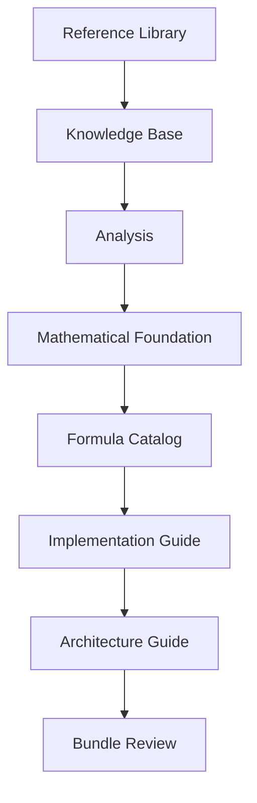
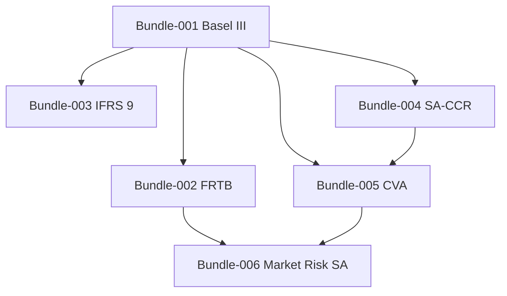
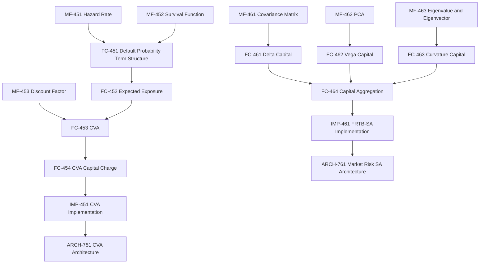

# FRKP-KG-001 — Master Knowledge Graph

---

# 1. Document Information

| Item | Value |
|------|-------|
| Document ID | FRKP-KG-001 |
| Document Name | Master Knowledge Graph |
| Version | 1.0.0 |
| Status | Active |
| Category | Knowledge Graph |
| Created | 2026-06-27 |
| Last Updated | 2026-06-27 |
| Scope | FRKP Repository v1.0 |

---

<!-- FRKP-NAV-START -->
[Financial Risk Knowledge Platform](../../README.md) > [Home](../../README.md) > [Project Management](../README.md) > [Reviews](FRKP_REPOSITORY_VERIFICATION_REPORT.md) > [FRKP-KG-001 — Master Knowledge Graph](FRKP-KG-001_MASTER_KNOWLEDGE_GRAPH.md)

---

## Navigation

| Navigation | Document |
|------------|----------|
| ⬅ Previous | [FRKP-REV-005](FRKP-REV-005_KNOWLEDGE_CONSISTENCY_REVIEW.md) |
| ⬆ Parent Bundle | None |
| ⬆ Parent Layer | [Reviews](FRKP_REPOSITORY_VERIFICATION_REPORT.md) |
| ➡ Next | None |

### Related Documents

- [FRKP-REV-001](FRKP-REV-001_REPOSITORY_FREEZE_REVIEW.md)
- [FRKP-REV-002](FRKP-REV-002_BUNDLE_STRUCTURE_REVIEW.md)
- [FRKP-REV-004](FRKP-REV-004_DOCUMENT_QUALITY_REVIEW.md)
- [FRKP-REV-005](FRKP-REV-005_KNOWLEDGE_CONSISTENCY_REVIEW.md)
<!-- FRKP-NAV-END -->

# 2. Purpose

This document defines the FRKP Master Knowledge Graph for the Financial Risk Knowledge Platform v1.0 freeze certification phase.

The graph records document-level and concept-level relationships across project management, governance standards, reference library, knowledge base, analysis, mathematical foundation, formula catalog, implementation guide, architecture guide, and bundle review documents.

# 3. Scope

Included source folders:

| Folder | Included |
|--------|----------|
| 00_Project_Management | Yes |
| 01_Reference_Library | Yes |
| 02_Knowledge_Base | Yes |
| 03_Analysis | Yes |
| 04_Formula_Catalog | Yes |
| 05_Mathematical_Foundation | Yes |
| 06_Implementation_Guide | Yes |
| 07_Architecture | Yes |
| 08_Bundles | Yes |

Excluded folders unless explicitly referenced:

| Folder | Treatment |
|--------|-----------|
| 09_Assets | Excluded |
| 10_Glossary | Excluded |
| 11_Volumes | Excluded |
| 12_Appendix | Excluded |
| 13_Output | Excluded |
| 99_Archive | Excluded |

# 4. Knowledge Graph Method

Relationships were extracted from:

| Evidence Source | Evidence Type |
|-----------------|---------------|
| Cross References sections | Explicit |
| Related Documents sections | Explicit |
| Relationship with FRKP sections | Explicit |
| Relationship with Other Standards sections | Explicit |
| Parent Bundle metadata | Explicit |
| Parent Standard metadata | Explicit |
| Explicit document title relationships | Explicit |
| Layer order across repository folders | Inferred |
| Bundle folder structure | Inferred |

No source documents were modified. Unresolved references and planned documents are reported as observations only.

# 5. Document Inventory

## 4.1 Governance and Project Management Documents

| File Path | Filename | Document ID / Standard ID | Document Name | Category | Parent Bundle | Parent Standard | Status | Version |
|-----------|----------|---------------------------|---------------|----------|---------------|-----------------|--------|---------|
| 00_Project_Management/Governance/FRKP-000_PROJECT_BOOTSTRAP.md | FRKP-000_PROJECT_BOOTSTRAP.md | FRKP-000 | Project Bootstrap | Project Management | - | - | Draft | 1.0.0 |
| 00_Project_Management/Governance/FRKP-001_PROJECT_CHARTER.md | FRKP-001_PROJECT_CHARTER.md | FRKP-001 | Project Charter | Project Management | - | - | Draft | 1.0.0 |
| 00_Project_Management/Metadata/FRKP-002_DOCUMENT_METADATA_STANDARD.md | FRKP-002_DOCUMENT_METADATA_STANDARD.md | FRKP-002 | Document Metadata Standard | Metadata | - | - | Draft | 1.0.0 |
| 00_Project_Management/FRKP-003_PROJECT_INDEX.md | FRKP-003_PROJECT_INDEX.md | FRKP-003 | Project Index | Project Management | - | - | Draft | 1.0.0 |
| 00_Project_Management/Roadmap/FRKP-004_ROADMAP.md | FRKP-004_ROADMAP.md | FRKP-004 | Roadmap | Project Management | - | - | Draft | 1.0.0 |
| 00_Project_Management/Backlog/FRKP-005_BACKLOG.md | FRKP-005_BACKLOG.md | FRKP-005 | Backlog | Project Management | - | - | Draft | 1.0.0 |
| 00_Project_Management/CurrentWork/FRKP-006_CURRENT_WORK.md | FRKP-006_CURRENT_WORK.md | FRKP-006 | Current Work | Project Management | - | - | Active | 1.0.0 |
| 00_Project_Management/Roadmap/FRKP_MASTER_ROADMAP.md | FRKP_MASTER_ROADMAP.md | FRKP-RMAP-001 | FRKP Master Roadmap | Project Governance | - | - | Active | 1.1.0 |
| 00_Project_Management/Roadmap/FRKP_BUNDLE_INDEX.md | FRKP_BUNDLE_INDEX.md | FRKP-PM-010 | FRKP Bundle Index | Project Management | - | - | Draft | 1.0.0 |
| 00_Project_Management/Governance/FRKP-DOC-100_MASTER_DOCUMENT_INDEX.md | FRKP-DOC-100_MASTER_DOCUMENT_INDEX.md | FRKP-DOC-100 | Master Document Index | Governance Index | - | FRKP-DOC-001 | Active | 1.0.0 |
| 00_Project_Management/Governance/Standards/FRKP-DOC-001_DOCUMENT_STANDARD.md | FRKP-DOC-001_DOCUMENT_STANDARD.md | FRKP-DOC-001 | Document Standard | Governance Standard | - | - | Metadata incomplete | Metadata incomplete |
| 00_Project_Management/Governance/Standards/FRKP-ID-001_DOCUMENT_IDENTIFIER_STANDARD.md | FRKP-ID-001_DOCUMENT_IDENTIFIER_STANDARD.md | FRKP-ID-001 | Document Identifier Standard | Governance Standard | - | FRKP-DOC-001 | Frozen | 1.0.0 |
| 00_Project_Management/Governance/Standards/FRKP-FORM-001_FORMULA_STANDARD.md | FRKP-FORM-001_FORMULA_STANDARD.md | FRKP-FORM-001 | Formula Documentation Standard | Governance Standard | - | - | Active | 1.1.0 |
| 00_Project_Management/Governance/Standards/FRKP-IMP-001_IMPLEMENTATION_STANDARD.md | FRKP-IMP-001_IMPLEMENTATION_STANDARD.md | FRKP-IMP-001 | Implementation Documentation Standard | Governance Standard | - | - | Active | 1.0.0 |
| 00_Project_Management/Governance/Standards/FRKP-ARCH-001_ARCHITECTURE_STANDARD.md | FRKP-ARCH-001_ARCHITECTURE_STANDARD.md | FRKP-ARCH-001 | Architecture Documentation Standard | Governance Standard | - | - | Active | 1.0.0 |
| 00_Project_Management/Governance/Standards/FRKP-BUNDLE-001_BUNDLE_STANDARD.md | FRKP-BUNDLE-001_BUNDLE_STANDARD.md | FRKP-BUNDLE-001 | Bundle Standard | Governance Standard | - | - | Active | 1.1.0 |
| 00_Project_Management/Governance/Standards/FRKP-ABBR-001_ABBREVIATION_STANDARD.md | FRKP-ABBR-001_ABBREVIATION_STANDARD.md | FRKP-ABBR-001 | Abbreviation Standard | Governance Standard | - | - | Active | 1.0.0 |
| 00_Project_Management/Governance/Standards/FRKP-SYM-001_FORMULA_SYMBOL_STANDARD.md | FRKP-SYM-001_FORMULA_SYMBOL_STANDARD.md | FRKP-SYM-001 | Formula Symbol Standard | Governance Standard | - | - | Active | 1.0.0 |
| 00_Project_Management/Governance/Standards/FRKP-TERM-001_GLOSSARY_STANDARD.md | FRKP-TERM-001_GLOSSARY_STANDARD.md | FRKP-TERM-001 | Glossary Standard | Governance Standard | - | - | Active | 1.0.0 |
| 00_Project_Management/Governance/Standards/Dictionary/FRKP-ABBR-100_MASTER_ABBREVIATION.md | FRKP-ABBR-100_MASTER_ABBREVIATION.md | FRKP-ABBR-100 | Master Abbreviation Dictionary | Governance / Master Dictionary | - | FRKP-ABBR-001 | Active | 1.0.0 |
| 00_Project_Management/Governance/Standards/Dictionary/FRKP-SYM-100_MASTER_SYMBOL_DICTIONARY.md | FRKP-SYM-100_MASTER_SYMBOL_DICTIONARY.md | FRKP-SYM-100 | Master Symbol Dictionary | Governance / Master Dictionary | - | FRKP-SYM-001 | Active | 1.0.0 |
| 00_Project_Management/Governance/Standards/Glossary/FRKP-TERM-100_MASTER_GLOSSARY.md | FRKP-TERM-100_MASTER_GLOSSARY.md | FRKP-TERM-100 | Master Glossary | Governance / Master Dictionary | - | FRKP-TERM-001 | Active | 1.0.0 |
| 00_Project_Management/Reviews/FRKP-REV-001_REPOSITORY_FREEZE_REVIEW.md | FRKP-REV-001_REPOSITORY_FREEZE_REVIEW.md | FRKP-REV-001 | Repository Freeze Review | Repository Review | - | - | Approved | 1.0.0 |
| 00_Project_Management/Reviews/FRKP-REV-002_BUNDLE_STRUCTURE_REVIEW.md | FRKP-REV-002_BUNDLE_STRUCTURE_REVIEW.md | FRKP-REV-002 | Bundle Structure Review | Repository Review | - | - | Approved | 1.0.0 |
| 00_Project_Management/Reviews/FRKP-REV-004_DOCUMENT_QUALITY_REVIEW.md | FRKP-REV-004_DOCUMENT_QUALITY_REVIEW.md | FRKP-REV-004 | Document Quality Review | Quality Review | - | - | Approved | 1.0.0 |
| 00_Project_Management/Reviews/FRKP-REV-005_KNOWLEDGE_CONSISTENCY_REVIEW.md | FRKP-REV-005_KNOWLEDGE_CONSISTENCY_REVIEW.md | FRKP-REV-005 | Knowledge Consistency Review | Knowledge Governance Review | - | - | Approved | 1.0.0 |
| 00_Project_Management/Reviews/FRKP_REPOSITORY_EVIDENCE.md | FRKP_REPOSITORY_EVIDENCE.md | Title-derived | FRKP Repository Evidence Collection | Review Evidence | - | - | Not specified | Not specified |
| 00_Project_Management/Reviews/FRKP_REPOSITORY_FIX_REPORT.md | FRKP_REPOSITORY_FIX_REPORT.md | Title-derived | FRKP Repository Fix Report | Review Evidence | - | - | Not specified | Not specified |
| 00_Project_Management/Reviews/FRKP_REPOSITORY_VERIFICATION_REPORT.md | FRKP_REPOSITORY_VERIFICATION_REPORT.md | Title-derived | FRKP Repository Verification Report | Review Evidence | - | - | Not specified | Not specified |

Template and README files in the included folders were present but generally do not define production graph nodes beyond their folder or template role.

## 4.2 Knowledge Layer Documents

| File Path | Filename | Document ID | Document Name | Category | Parent Bundle | Status | Version |
|-----------|----------|-------------|---------------|----------|---------------|--------|---------|
| 01_Reference_Library/01_Basel_III/RL-001_BASEL_III_OVERVIEW.md | RL-001_BASEL_III_OVERVIEW.md | RL-001 | Basel III Overview | Reference Library | Inferred Bundle-001 | Draft | 1.0.0 |
| 02_Knowledge_Base/01_Basel_III/KB-201_FINANCIAL_RISK_OVERVIEW.md | KB-201_FINANCIAL_RISK_OVERVIEW.md | KB-201 | Financial Risk Overview | Knowledge Base | Inferred Bundle-001 | Draft | 1.0.0 |
| 02_Knowledge_Base/01_Basel_III/KB-301_BASEL_III_FRAMEWORK.md | KB-301_BASEL_III_FRAMEWORK.md | KB-301 | Basel III Framework | Knowledge Base | Inferred Bundle-001 | Draft | 1.0.0 |
| 04_Formula_Catalog/01_Basel_III/FC-401_CAPITAL_ADEQUACY_RATIO.md | FC-401_CAPITAL_ADEQUACY_RATIO.md | FC-401 | Capital Adequacy Ratio | Formula Catalog | Inferred Bundle-001 | Draft | 1.0.0 |
| 04_Formula_Catalog/01_Basel_III/FC-402_RISK_WEIGHTED_ASSETS.md | FC-402_RISK_WEIGHTED_ASSETS.md | FC-402 | Risk Weighted Assets | Formula Catalog | Inferred Bundle-001 | Draft | 1.0.0 |
| 07_Architecture/01_Basel_III/ARCH-701_CAPITAL_CALCULATION_ARCHITECTURE.md | ARCH-701_CAPITAL_CALCULATION_ARCHITECTURE.md | ARCH-701 | Capital Calculation Architecture | Architecture Guide | Inferred Bundle-001 | Draft | 1.0.0 |
| 08_Bundles/BUNDLE-001_BASEL_III_REVIEW.md | BUNDLE-001_BASEL_III_REVIEW.md | BUNDLE-001 | Basel III Review | Bundle Review | Bundle-001 | Review | 1.0.0 |
| 01_Reference_Library/02_FRTB/RL-120_FRTB_OVERVIEW.md | RL-120_FRTB_OVERVIEW.md | RL-120 | FRTB Overview | Reference Library | Inferred Bundle-002 | Draft | 1.0.0 |
| 02_Knowledge_Base/02_FRTB/KB-221_MARKET_RISK_OVERVIEW.md | KB-221_MARKET_RISK_OVERVIEW.md | KB-221 | Market Risk Overview | Knowledge Base | Inferred Bundle-002 | Draft | 1.0.0 |
| 02_Knowledge_Base/02_FRTB/KB-222_FRTB_FRAMEWORK.md | KB-222_FRTB_FRAMEWORK.md | KB-222 | FRTB Framework | Knowledge Base | Inferred Bundle-002 | Draft | 1.0.0 |
| 03_Analysis/02_FRTB/AN-221_WHY_VAR_FAILED.md | AN-221_WHY_VAR_FAILED.md | AN-221 | Why VaR Failed | Analysis | Inferred Bundle-002 | Draft | 1.0.0 |
| 04_Formula_Catalog/02_FRTB/FC-421_EXPECTED_SHORTFALL.md | FC-421_EXPECTED_SHORTFALL.md | FC-421 | Expected Shortfall | Formula Catalog | Inferred Bundle-002 | Draft | 1.0.0 |
| 04_Formula_Catalog/02_FRTB/FC-422_LIQUIDITY_HORIZON.md | FC-422_LIQUIDITY_HORIZON.md | FC-422 | Liquidity Horizon | Formula Catalog | Inferred Bundle-002 | Draft | 1.0.0 |
| 04_Formula_Catalog/02_FRTB/FC-423_SENSITIVITY_BASED_METHOD.md | FC-423_SENSITIVITY_BASED_METHOD.md | FC-423 | Sensitivity-Based Method | Formula Catalog | Inferred Bundle-002 | Draft | 1.0.0 |
| 04_Formula_Catalog/02_FRTB/FC-424_DELTA_RISK_CHARGE.md | FC-424_DELTA_RISK_CHARGE.md | FC-424 | Delta Risk Charge | Formula Catalog | Inferred Bundle-002 | Draft | 1.0.0 |
| 04_Formula_Catalog/02_FRTB/FC-425_VEGA_RISK_CHARGE.md | FC-425_VEGA_RISK_CHARGE.md | FC-425 | Vega Risk Charge | Formula Catalog | Inferred Bundle-002 | Draft | 1.0.0 |
| 04_Formula_Catalog/02_FRTB/FC-426_CURVATURE_RISK_CHARGE.md | FC-426_CURVATURE_RISK_CHARGE.md | FC-426 | Curvature Risk Charge | Formula Catalog | Inferred Bundle-002 | Draft | 1.0.0 |
| 07_Architecture/02_FRTB/ARCH-721_FRTB_CALCULATION_ARCHITECTURE.md | ARCH-721_FRTB_CALCULATION_ARCHITECTURE.md | ARCH-721 | FRTB Calculation Architecture | Architecture | Inferred Bundle-002 | Draft | 1.0.0 |
| 08_Bundles/BUNDLE-002_FRTB_REVIEW.md | BUNDLE-002_FRTB_REVIEW.md | BUNDLE-002 | FRTB Review | Bundle Review | Bundle-002 | Review | 1.0.0 |
| 01_Reference_Library/03_IFRS9/RL-130_IFRS9_OVERVIEW.md | RL-130_IFRS9_OVERVIEW.md | RL-130 | IFRS 9 Overview | Reference Library | Inferred Bundle-003 | Draft | 1.0.0 |
| 02_Knowledge_Base/03_IFRS9/KB-231_CREDIT_RISK_OVERVIEW.md | KB-231_CREDIT_RISK_OVERVIEW.md | KB-231 | Credit Risk Overview | Knowledge Base | Inferred Bundle-003 | Draft | 1.0.0 |
| 02_Knowledge_Base/03_IFRS9/KB-232_IFRS9_FRAMEWORK.md | KB-232_IFRS9_FRAMEWORK.md | KB-232 | IFRS 9 Framework | Knowledge Base | Inferred Bundle-003 | Draft | 1.0.0 |
| 03_Analysis/03_IFRS9/AN-231_WHY_INCURRED_LOSS_FAILED.md | AN-231_WHY_INCURRED_LOSS_FAILED.md | AN-231 | Why Incurred Loss Failed | Analysis | Inferred Bundle-003 | Draft | 1.0.0 |
| 04_Formula_Catalog/03_IFRS9/FC-431_PROBABILITY_OF_DEFAULT.md | FC-431_PROBABILITY_OF_DEFAULT.md | FC-431 | Probability of Default | Formula Catalog | Inferred Bundle-003 | Draft | 1.0.0 |
| 04_Formula_Catalog/03_IFRS9/FC-432_LOSS_GIVEN_DEFAULT.md | FC-432_LOSS_GIVEN_DEFAULT.md | FC-432 | Loss Given Default | Formula Catalog | Inferred Bundle-003 | Draft | 1.0.0 |
| 04_Formula_Catalog/03_IFRS9/FC-433_EXPOSURE_AT_DEFAULT.md | FC-433_EXPOSURE_AT_DEFAULT.md | FC-433 | Exposure at Default | Formula Catalog | Inferred Bundle-003 | Draft | 1.0.0 |
| 04_Formula_Catalog/03_IFRS9/FC-434_EXPECTED_CREDIT_LOSS.md | FC-434_EXPECTED_CREDIT_LOSS.md | FC-434 | Expected Credit Loss | Formula Catalog | Inferred Bundle-003 | Draft | 1.0.0 |
| 06_Implementation_Guide/03_IFRS9/IMP-431_EXPECTED_CREDIT_LOSS_IMPLEMENTATION.md | IMP-431_EXPECTED_CREDIT_LOSS_IMPLEMENTATION.md | IMP-431 | Expected Credit Loss Implementation | Implementation Guide | Inferred Bundle-003 | Draft | 1.0.0 |
| 07_Architecture/03_IFRS9/ARCH-731_IFRS9_CALCULATION_ARCHITECTURE.md | ARCH-731_IFRS9_CALCULATION_ARCHITECTURE.md | ARCH-731 | IFRS 9 Calculation Architecture | Architecture | Inferred Bundle-003 | Draft | 1.0.0 |
| 08_Bundles/BUNDLE-003_IFRS9_REVIEW.md | BUNDLE-003_IFRS9_REVIEW.md | BUNDLE-003 | IFRS 9 Review | Bundle Review | Bundle-003 | Review | 1.0.0 |
| 01_Reference_Library/04_SA_CCR/RL-140_SA_CCR_OVERVIEW.md | RL-140_SA_CCR_OVERVIEW.md | RL-140 | SA-CCR Overview | Reference Library | Inferred Bundle-004 | Draft | 1.0.0 |
| 02_Knowledge_Base/04_SA_CCR/KB-241_COUNTERPARTY_CREDIT_RISK.md | KB-241_COUNTERPARTY_CREDIT_RISK.md | KB-241 | Counterparty Credit Risk | Knowledge Base | Inferred Bundle-004 | Draft | 1.0.0 |
| 02_Knowledge_Base/04_SA_CCR/KB-242_SA_CCR_FRAMEWORK.md | KB-242_SA_CCR_FRAMEWORK.md | KB-242 | SA-CCR Framework | Knowledge Base | Inferred Bundle-004 | Draft | 1.0.0 |
| 03_Analysis/04_SA_CCR/AN-241_WHY_CEM_FAILED.md | AN-241_WHY_CEM_FAILED.md | AN-241 | Why Current Exposure Method (CEM) Failed | Analysis | Inferred Bundle-004 | Draft | 1.0.0 |
| 04_Formula_Catalog/04_SA_CCR/FC-441_REPLACEMENT_COST.md | FC-441_REPLACEMENT_COST.md | FC-441 | Replacement Cost | Formula Catalog | Inferred Bundle-004 | Draft | 1.0.0 |
| 04_Formula_Catalog/04_SA_CCR/FC-442_POTENTIAL_FUTURE_EXPOSURE.md | FC-442_POTENTIAL_FUTURE_EXPOSURE.md | FC-442 | Potential Future Exposure | Formula Catalog | Inferred Bundle-004 | Draft | 1.0.0 |
| 04_Formula_Catalog/04_SA_CCR/FC-443_ALPHA.md | FC-443_ALPHA.md | FC-443 | Alpha | Formula Catalog | Inferred Bundle-004 | Draft | 1.0.0 |
| 04_Formula_Catalog/04_SA_CCR/FC-444_SA_CCR_EAD.md | FC-444_SA_CCR_EAD.md | FC-444 | Exposure at Default (SA-CCR) | Formula Catalog | Inferred Bundle-004 | Draft | 1.0.0 |
| 06_Implementation_Guide/04_SA_CCR/IMP-441_SA_CCR_IMPLEMENTATION.md | IMP-441_SA_CCR_IMPLEMENTATION.md | IMP-441 | SA-CCR Implementation Guide | Implementation Guide | Inferred Bundle-004 | Draft | 1.0.0 |
| 07_Architecture/04_SA_CCR/ARCH-741_SA_CCR_ARCHITECTURE.md | ARCH-741_SA_CCR_ARCHITECTURE.md | ARCH-741 | SA-CCR Calculation Architecture | Architecture Guide | Inferred Bundle-004 | Draft | 1.0.0 |
| 08_Bundles/BUNDLE-004_SA_CCR_REVIEW.md | BUNDLE-004_SA_CCR_REVIEW.md | BUNDLE-004 | SA-CCR Review | Bundle Review | Bundle-004 | Completed | 1.0.0 |
| 01_Reference_Library/05_CVA/RL-150_CVA_OVERVIEW.md | RL-150_CVA_OVERVIEW.md | RL-150 | Credit Valuation Adjustment (CVA) Overview | Reference Library | Bundle-005 | Active | 1.0.0 |
| 02_Knowledge_Base/05_CVA/KB-251_CREDIT_VALUATION_ADJUSTMENT.md | KB-251_CREDIT_VALUATION_ADJUSTMENT.md | KB-251 | Credit Valuation Adjustment | Knowledge Base | Bundle-005 | Active | 1.0.0 |
| 02_Knowledge_Base/05_CVA/KB-252_CVA_FRAMEWORK.md | KB-252_CVA_FRAMEWORK.md | KB-252 | CVA Framework | Knowledge Base | Bundle-005 | Active | 1.0.0 |
| 03_Analysis/05_CVA/AN-251_WHY_CVA_WAS_INTRODUCED.md | AN-251_WHY_CVA_WAS_INTRODUCED.md | AN-251 | Why Credit Valuation Adjustment (CVA) Was Introduced | Analysis | Bundle-005 | Active | 1.0.0 |
| 05_Mathematical_Foundation/05_CVA/MF-451_HAZARD_RATE.md | MF-451_HAZARD_RATE.md | MF-451 | Hazard Rate | Mathematical Foundation | Bundle-005 | Active | 1.0.0 |
| 05_Mathematical_Foundation/05_CVA/MF-452_SURVIVAL_FUNCTION.md | MF-452_SURVIVAL_FUNCTION.md | MF-452 | Survival Function | Mathematical Foundation | Bundle-005 | Active | 1.0.0 |
| 05_Mathematical_Foundation/05_CVA/MF-453_DISCOUNT_FACTOR.md | MF-453_DISCOUNT_FACTOR.md | MF-453 | Discount Factor | Mathematical Foundation | Bundle-005 | Active | 1.0.0 |
| 04_Formula_Catalog/05_CVA/FC-451_DEFAULT_PROBABILITY_TERM_STRUCTURE.md | FC-451_DEFAULT_PROBABILITY_TERM_STRUCTURE.md | FC-451 | Default Probability Term Structure | Formula Catalog | Bundle-005 | Active | 1.0.0 |
| 04_Formula_Catalog/05_CVA/FC-452_EXPECTED_EXPOSURE.md | FC-452_EXPECTED_EXPOSURE.md | FC-452 | Expected Exposure | Formula Catalog | Bundle-005 | Active | 1.0.0 |
| 04_Formula_Catalog/05_CVA/FC-453_CREDIT_VALUATION_ADJUSTMENT.md | FC-453_CREDIT_VALUATION_ADJUSTMENT.md | FC-453 | Credit Valuation Adjustment | Formula Catalog | Bundle-005 | Active | 1.0.0 |
| 04_Formula_Catalog/05_CVA/FC-454_CVA_CAPITAL_CHARGE.md | FC-454_CVA_CAPITAL_CHARGE.md | FC-454 | CVA Capital Charge | Formula Catalog | Bundle-005 | Metadata incomplete | Metadata incomplete |
| 06_Implementation_Guide/05_CVA/IMP-451_CVA_IMPLEMENTATION.md | IMP-451_CVA_IMPLEMENTATION.md | IMP-451 | CVA Implementation Guide | Implementation Guide | Bundle-005 | Active | 1.0.0 |
| 07_Architecture/05_CVA/ARCH-751_CVA_ARCHITECTURE.md | ARCH-751_CVA_ARCHITECTURE.md | ARCH-751 | CVA Architecture | Architecture Guide | Bundle-005 | Active | 1.0.0 |
| 08_Bundles/BUNDLE-005_CVA_REVIEW.md | BUNDLE-005_CVA_REVIEW.md | BUNDLE-005 | CVA Bundle Review | Bundle Review | Bundle-005 | Frozen Candidate | 1.0.0 |
| 01_Reference_Library/06_Market_Risk_Standardized_Approach/RL-160_MARKET_RISK_STANDARDIZED_APPROACH_OVERVIEW.md | RL-160_MARKET_RISK_STANDARDIZED_APPROACH_OVERVIEW.md | RL-160 | Market Risk Standardized Approach Overview | Reference Library | Bundle-006 | Active | 1.0.0 |
| 02_Knowledge_Base/06_Market_Risk_Standardized_Approach/KB-261_MARKET_RISK_STANDARDIZED_APPROACH.md | KB-261_MARKET_RISK_STANDARDIZED_APPROACH.md | KB-261 | Market Risk Standardized Approach | Knowledge Base | Bundle-006 | Active | 1.0.0 |
| 02_Knowledge_Base/06_Market_Risk_Standardized_Approach/KB-262_SENSITIVITY_BASED_METHOD.md | KB-262_SENSITIVITY_BASED_METHOD.md | KB-262 | Sensitivity Based Method | Knowledge Base | Bundle-006 | Metadata incomplete | Metadata incomplete |
| 02_Knowledge_Base/06_Market_Risk_Standardized_Approach/KB-263_RISK_FACTOR_CATEGORIES.md | KB-263_RISK_FACTOR_CATEGORIES.md | KB-263 | Risk Factor Categories | Knowledge Base | Bundle-006 | Active | 1.0.0 |
| 03_Analysis/06_Market_Risk_Standardized_Approach/AN-261_WHY_FRTB_REPLACED_VAR.md | AN-261_WHY_FRTB_REPLACED_VAR.md | AN-261 | Why FRTB Replaced VaR | Analysis | Bundle-006 | Active | 1.0.0 |
| 05_Mathematical_Foundation/06_Market_Risk_Standardized_Approach/MF-461_COVARIANCE_MATRIX.md | MF-461_COVARIANCE_MATRIX.md | MF-461 | Covariance Matrix | Mathematical Foundation | Bundle-006 | Active | 1.0.0 |
| 05_Mathematical_Foundation/06_Market_Risk_Standardized_Approach/MF-462_PRINCIPAL_COMPONENT_ANALYSIS.md | MF-462_PRINCIPAL_COMPONENT_ANALYSIS.md | MF-462 | Principal Component Analysis | Mathematical Foundation | Bundle-006 | Active | 1.0.0 |
| 05_Mathematical_Foundation/06_Market_Risk_Standardized_Approach/MF-463_EIGENVALUE_AND_EIGENVECTOR.md | MF-463_EIGENVALUE_AND_EIGENVECTOR.md | MF-463 | Eigenvalue and Eigenvector | Mathematical Foundation | Bundle-006 | Active | 1.0.0 |
| 04_Formula_Catalog/06_Market_Risk_Standardized_Approach/FC-461_DELTA_CAPITAL_FORMULA.md | FC-461_DELTA_CAPITAL_FORMULA.md | FC-461 | Delta Capital Formula | Formula Catalog | Bundle-006 | Active | 1.0.0 |
| 04_Formula_Catalog/06_Market_Risk_Standardized_Approach/FC-462_VEGA_CAPITAL_FORMULA.md | FC-462_VEGA_CAPITAL_FORMULA.md | FC-462 | Vega Capital Formula | Formula Catalog | Bundle-006 | Active | 1.0.0 |
| 04_Formula_Catalog/06_Market_Risk_Standardized_Approach/FC-463_CURVATURE_CAPITAL_FORMULA.md | FC-463_CURVATURE_CAPITAL_FORMULA.md | FC-463 | Curvature Capital Formula | Formula Catalog | Bundle-006 | Active | 1.0.0 |
| 04_Formula_Catalog/06_Market_Risk_Standardized_Approach/FC-464_CAPITAL_AGGREGATION.md | FC-464_CAPITAL_AGGREGATION.md | FC-464 | Capital Aggregation | Formula Catalog | Bundle-006 | Active | 1.0.0 |
| 06_Implementation_Guide/06_Market_Risk_Standardized_Approach/IMP-461_FRTB_SA_IMPLEMENTATION.md | IMP-461_FRTB_SA_IMPLEMENTATION.md | IMP-461 | FRTB Standardized Approach Implementation Guide | Implementation Guide | Bundle-006 | Active | 1.0.0 |
| 07_Architecture/06_Market_Risk_Standardized_Approach/ARCH-761_MARKET_RISK_SA_ARCHITECTURE.md | ARCH-761_MARKET_RISK_SA_ARCHITECTURE.md | ARCH-761 | Market Risk Standardized Approach Architecture | Architecture Guide | Bundle-006 | Active | 1.0.0 |
| 08_Bundles/BUNDLE-006_MARKET_RISK_STANDARDIZED_APPROACH_REVIEW.md | BUNDLE-006_MARKET_RISK_STANDARDIZED_APPROACH_REVIEW.md | BUNDLE-006 | Market Risk Standardized Approach Review | Bundle Review | Bundle-006 | Completed | 1.0.0 |

# 6. Layer Graph

## 5.1 Canonical Layer Flow

| Source Layer | Target Layer | Relationship Type | Evidence Type |
|--------------|--------------|-------------------|---------------|
| Reference Library | Knowledge Base | supports | Inferred |
| Knowledge Base | Analysis | supports | Inferred |
| Analysis | Mathematical Foundation | supports | Inferred |
| Mathematical Foundation | Formula Catalog | supports | Inferred |
| Formula Catalog | Implementation Guide | implements | Inferred |
| Implementation Guide | Architecture Guide | supports | Inferred |
| Architecture Guide | Bundle Review | supports | Inferred |

## 5.2 Layer Presence by Bundle

| Bundle | Reference Library | Knowledge Base | Analysis | Mathematical Foundation | Formula Catalog | Implementation Guide | Architecture Guide | Bundle Review |
|--------|-------------------|----------------|----------|-------------------------|-----------------|----------------------|--------------------|---------------|
| Bundle-001 Basel III | Present | Present | Missing | Missing | Present | Missing | Present | Present |
| Bundle-002 FRTB | Present | Present | Present | Missing | Present | Missing / referenced as planned IMP-421 | Present | Present |
| Bundle-003 IFRS 9 | Present | Present | Present | Missing | Present | Present | Present | Present |
| Bundle-004 SA-CCR | Present | Present | Present | Missing | Present | Present | Present | Present |
| Bundle-005 CVA | Present | Present | Present | Present | Present | Present | Present | Present |
| Bundle-006 Market Risk Standardized Approach | Present | Present | Present | Present | Present | Present | Present | Present |

# 7. Bundle Graph

## 6.1 Bundle-001 Basel III

| Document | Relationship | Evidence Type |
|----------|--------------|---------------|
| RL-001 | bundle_member | Inferred from folder path |
| KB-201 | bundle_member | Inferred from folder path |
| KB-301 | bundle_member | Inferred from folder path |
| FC-401 | bundle_member | Inferred from folder path |
| FC-402 | bundle_member | Inferred from folder path |
| ARCH-701 | bundle_member | Inferred from folder path |
| BUNDLE-001 | reviews Bundle-001 documents | Explicit title / bundle review |

## 6.2 Bundle-002 FRTB

| Document | Relationship | Evidence Type |
|----------|--------------|---------------|
| RL-120 | bundle_member | Inferred from folder path |
| KB-221 | bundle_member | Inferred from folder path |
| KB-222 | bundle_member | Inferred from folder path |
| AN-221 | bundle_member | Inferred from folder path |
| FC-421, FC-422, FC-423, FC-424, FC-425, FC-426 | bundle_member | Inferred from folder path |
| ARCH-721 | bundle_member | Inferred from folder path |
| BUNDLE-002 | reviews Bundle-002 documents | Explicit title / bundle review |

## 6.3 Bundle-003 IFRS 9

| Document | Relationship | Evidence Type |
|----------|--------------|---------------|
| RL-130 | bundle_member | Inferred from folder path |
| KB-231, KB-232 | bundle_member | Inferred from folder path |
| AN-231 | bundle_member | Inferred from folder path |
| FC-431, FC-432, FC-433, FC-434 | bundle_member | Inferred from folder path |
| IMP-431 | bundle_member | Inferred from folder path |
| ARCH-731 | bundle_member | Inferred from folder path |
| BUNDLE-003 | reviews Bundle-003 documents | Explicit title / bundle review |

## 6.4 Bundle-004 SA-CCR

| Document | Relationship | Evidence Type |
|----------|--------------|---------------|
| RL-140 | bundle_member | Inferred from folder path |
| KB-241, KB-242 | bundle_member | Inferred from folder path |
| AN-241 | bundle_member | Inferred from folder path |
| FC-441, FC-442, FC-443, FC-444 | bundle_member | Inferred from folder path |
| IMP-441 | bundle_member | Inferred from folder path |
| ARCH-741 | bundle_member | Inferred from folder path |
| BUNDLE-004 | reviews Bundle-004 documents | Explicit title / bundle review |

## 6.5 Bundle-005 CVA

| Document | Relationship | Evidence Type |
|----------|--------------|---------------|
| RL-150 | parent_bundle Bundle-005 | Explicit metadata |
| KB-251, KB-252 | parent_bundle Bundle-005 | Explicit metadata |
| AN-251 | parent_bundle Bundle-005 | Explicit metadata |
| MF-451, MF-452, MF-453 | parent_bundle Bundle-005 | Explicit metadata |
| FC-451, FC-452, FC-453, FC-454 | parent_bundle Bundle-005 | Explicit metadata / bundle review |
| IMP-451 | parent_bundle Bundle-005 | Explicit metadata |
| ARCH-751 | parent_bundle Bundle-005 | Explicit metadata |
| BUNDLE-005 | reviews Bundle-005 documents | Explicit cross references |

## 6.6 Bundle-006 Market Risk Standardized Approach

| Document | Relationship | Evidence Type |
|----------|--------------|---------------|
| RL-160 | parent_bundle Bundle-006 | Explicit metadata |
| KB-261, KB-262, KB-263 | parent_bundle Bundle-006 | Explicit metadata / bundle review |
| AN-261 | parent_bundle Bundle-006 | Explicit metadata |
| MF-461, MF-462, MF-463 | parent_bundle Bundle-006 | Explicit metadata |
| FC-461, FC-462, FC-463, FC-464 | parent_bundle Bundle-006 | Explicit metadata |
| IMP-461 | parent_bundle Bundle-006 | Explicit metadata |
| ARCH-761 | parent_bundle Bundle-006 | Explicit metadata |
| BUNDLE-006 | reviews Bundle-006 documents | Explicit cross references |
| BUNDLE-006 | follows Bundle-001 through Bundle-005 roadmap sequence | Explicit roadmap relationship |

# 8. Explicit Cross Reference Graph

The following edge set records the principal explicit relationships found in metadata, Cross References, Related Documents, Relationship with FRKP, and Relationship with Other Standards sections.

## 7.1 Governance Edges

| Source | Target | Relationship Type | Evidence Type |
|--------|--------|-------------------|---------------|
| FRKP-DOC-100 | FRKP-DOC-001 | parent_standard | Explicit |
| FRKP-DOC-100 | FRKP-ID-001 | references | Explicit |
| FRKP-DOC-100 | FRKP-BUNDLE-001 | references | Explicit |
| FRKP-DOC-100 | FRKP-RMAP-001 | references | Explicit |
| FRKP-ID-001 | FRKP-DOC-001 | parent_standard | Explicit |
| FRKP-ID-001 | FRKP-ARCH-001 | references | Explicit |
| FRKP-ID-001 | FRKP-BUNDLE-001 | references | Explicit |
| FRKP-FORM-001 | FRKP-DOC-001 | references | Explicit |
| FRKP-FORM-001 | FRKP-ID-001 | references | Explicit |
| FRKP-FORM-001 | FRKP-ARCH-001 | references | Explicit |
| FRKP-FORM-001 | FRKP-BUNDLE-001 | references | Explicit |
| FRKP-IMP-001 | FRKP-KB-001 | references | Explicit |
| FRKP-ARCH-001 | FRKP-IMP-001 | references | Explicit |
| FRKP-ARCH-001 | FRKP-BUNDLE-001 | references | Explicit |
| FRKP-ABBR-001 | FRKP-TERM-001 | references | Explicit |
| FRKP-ABBR-001 | FRKP-SYM-001 | references | Explicit |
| FRKP-SYM-001 | FRKP-FORM-001 | references | Explicit |
| FRKP-TERM-100 | FRKP-TERM-001 | parent_standard | Explicit |
| FRKP-ABBR-100 | FRKP-ABBR-001 | parent_standard | Explicit |
| FRKP-SYM-100 | FRKP-SYM-001 | parent_standard | Explicit |

## 7.2 Bundle and Knowledge Edges

| Source | Target | Relationship Type | Evidence Type |
|--------|--------|-------------------|---------------|
| RL-120 | KB-221, KB-222, AN-221, FC-421, FC-422, FC-423, ARCH-721 | references | Explicit |
| KB-221 | RL-120, KB-222, AN-221, FC-421, FC-422, ARCH-721 | references | Explicit |
| KB-222 | RL-120, KB-221, AN-221, FC-421, FC-422, FC-423, IMP-421, ARCH-721 | references | Explicit |
| RL-130 | KB-231, KB-232, AN-231, FC-431, FC-434, IMP-431, ARCH-731 | references | Explicit |
| KB-231 | RL-130, KB-232, AN-231, FC-431, FC-432, FC-433, FC-434, ARCH-731 | references | Explicit |
| KB-232 | RL-130, KB-231, AN-231, FC-431, FC-434, IMP-431, ARCH-731 | references | Explicit |
| RL-140 | KB-241, KB-242, AN-241, FC-441, FC-442, FC-443, FC-444, IMP-441, ARCH-741 | references | Explicit |
| RL-150 | RL-140, KB-251, KB-252, AN-251, FC-451, FC-452, FC-453, FC-454, IMP-451, ARCH-751 | references | Explicit |
| KB-251 | RL-150, AN-251, KB-252, MF-451, MF-452, MF-453, FC-451, FC-452, FC-453, FC-454, IMP-451, ARCH-751 | references | Explicit |
| KB-252 | RL-150, AN-251, MF-451, MF-452, MF-453, FC-451, FC-452, FC-453, FC-454, IMP-451, ARCH-751 | references | Explicit |
| AN-251 | RL-150, KB-251, KB-252, FC-451, FC-452, FC-453, FC-454, ARCH-751 | references | Explicit |
| BUNDLE-005 | RL-150, KB-251, KB-252, AN-251, MF-451, MF-452, MF-453, FC-451, FC-452, FC-453, FC-454, IMP-451, ARCH-751 | references | Explicit |
| RL-160 | Bundle-006 | parent_bundle | Explicit |
| KB-261 | RL-160, KB-262, KB-263, AN-261, MF-461, FC-461, IMP-461, ARCH-761 | references | Explicit |
| KB-263 | RL-160, KB-261, KB-262, AN-261, MF-461, MF-462, MF-463, FC-461, FC-462, FC-463, FC-464 | references | Explicit |
| AN-261 | RL-160, KB-261, KB-262, KB-263, MF-461, MF-462, MF-463, FC-461, FC-462, FC-463, FC-464 | references | Explicit |
| IMP-461 | RL-160, KB-261, KB-262, KB-263, AN-261, MF-461, MF-462, MF-463, FC-461, FC-462, FC-463, FC-464, ARCH-761 | references | Explicit |
| ARCH-761 | RL-160, KB-261, KB-262, KB-263, AN-261, MF-461, MF-462, MF-463, FC-461, FC-462, FC-463, FC-464, IMP-461 | references | Explicit |
| BUNDLE-006 | Bundle-001, Bundle-002, Bundle-003, Bundle-004, Bundle-005, Bundle-007 | roadmap_relationship | Explicit |

# 9. Formula Dependency Graph

## 8.1 Explicit Formula Edges

| Source | Target | Relationship Type | Evidence Type |
|--------|--------|-------------------|---------------|
| FC-422 | FC-421 | depends_on | Explicit |
| FC-423 | FC-421, FC-422 | depends_on | Explicit |
| FC-424 | FC-423 | depends_on | Explicit |
| FC-425 | FC-423 | depends_on | Explicit |
| FC-426 | FC-423 | depends_on | Explicit |
| FC-431 | FC-432, FC-433, FC-434 | supports | Explicit |
| FC-432 | FC-431, FC-433, FC-434 | supports | Explicit |
| FC-433 | FC-431, FC-432, FC-434 | supports | Explicit |
| FC-434 | FC-431, FC-432, FC-433 | depends_on | Explicit |
| FC-441 | FC-442, FC-443, FC-444 | supports | Explicit |
| FC-442 | FC-441, FC-443, FC-444 | supports | Explicit |
| FC-443 | FC-441, FC-444 | supports | Explicit |
| FC-444 | FC-441, FC-442, FC-443 | depends_on | Explicit |
| MF-451 | FC-451, FC-453 | supports | Explicit |
| MF-452 | FC-451, FC-452, FC-453 | supports | Explicit |
| MF-453 | FC-451, FC-452, FC-453 | supports | Explicit |
| FC-451 | FC-452, FC-453, FC-454 | supports | Explicit |
| FC-452 | FC-451, FC-453, FC-454 | supports | Explicit |
| FC-453 | FC-451, FC-452, FC-454 | depends_on | Explicit |
| MF-461 | FC-461, FC-464 | supports | Explicit |
| MF-462 | FC-461, FC-464 | supports | Explicit |
| MF-463 | FC-461, FC-462, FC-463, FC-464 | supports | Explicit |
| FC-461 | FC-462, FC-463, FC-464 | supports | Explicit |
| FC-462 | FC-461, FC-463, FC-464 | supports | Explicit |
| FC-463 | FC-461, FC-462, FC-464 | supports | Explicit |
| FC-464 | FC-461, FC-462, FC-463 | depends_on | Explicit |
| FC-461, FC-462, FC-463, FC-464 | IMP-461 | implements | Explicit |
| IMP-461 | ARCH-761 | supports | Explicit |

## 8.2 Inferred Formula Chains

| Chain | Relationship Type | Evidence Type |
|-------|-------------------|---------------|
| MF-451 -> FC-451 -> FC-453 -> IMP-451 -> ARCH-751 | formula_to_implementation_chain | Inferred |
| MF-452 -> FC-452 -> FC-453 -> IMP-451 -> ARCH-751 | formula_to_implementation_chain | Inferred |
| MF-453 -> FC-453 -> IMP-451 -> ARCH-751 | formula_to_implementation_chain | Inferred |
| MF-461 -> FC-461 -> FC-464 -> IMP-461 -> ARCH-761 | formula_to_implementation_chain | Inferred |
| MF-462 -> FC-462 -> FC-464 -> IMP-461 -> ARCH-761 | formula_to_implementation_chain | Inferred |
| MF-463 -> FC-463 -> FC-464 -> IMP-461 -> ARCH-761 | formula_to_implementation_chain | Inferred |

# 10. Concept Graph

| Concept Family | Mapped Documents | Evidence Type |
|----------------|------------------|---------------|
| Basel III | RL-001, KB-301, FC-401, FC-402, ARCH-701, BUNDLE-001 | Title / path |
| FRTB | RL-120, KB-222, AN-221, FC-421 to FC-426, ARCH-721, BUNDLE-002, AN-261, IMP-461 | Title / headings |
| IFRS 9 | RL-130, KB-232, AN-231, FC-431 to FC-434, IMP-431, ARCH-731, BUNDLE-003 | Title / path |
| SA-CCR | RL-140, KB-242, AN-241, FC-441 to FC-444, IMP-441, ARCH-741, BUNDLE-004 | Title / path |
| CVA | RL-150, KB-251, KB-252, AN-251, FC-453, FC-454, IMP-451, ARCH-751, BUNDLE-005 | Title / path |
| Market Risk SA | RL-160, KB-261, KB-262, KB-263, AN-261, MF-461 to MF-463, FC-461 to FC-464, IMP-461, ARCH-761, BUNDLE-006 | Title / path |
| PD | FC-431, FC-451, FRKP-ABBR-100, FRKP-SYM-100 | Title / dictionary |
| LGD | FC-432, FC-434, FRKP-ABBR-100, FRKP-SYM-100 | Title / dictionary |
| EAD | FC-433, FC-444, FRKP-ABBR-100, FRKP-SYM-100 | Title / dictionary |
| Hazard Rate | MF-451, FC-451, FC-453 | Title / cross reference |
| Survival Function | MF-452, FC-451, FC-452, FC-453 | Title / cross reference |
| Discount Factor | MF-453, FC-451, FC-452, FC-453 | Title / cross reference |
| Expected Exposure | FC-452, FC-453, FC-454, IMP-451 | Title / cross reference |
| Delta | FC-424, FC-461, FC-464, IMP-461, ARCH-761 | Title / cross reference |
| Vega | FC-425, FC-462, FC-464, IMP-461, ARCH-761 | Title / cross reference |
| Curvature | FC-426, FC-463, FC-464, IMP-461, ARCH-761 | Title / cross reference |
| Capital Aggregation | FC-464, IMP-461, ARCH-761 | Title / cross reference |
| Covariance Matrix | MF-461, FC-461, FC-464, IMP-461, ARCH-761 | Title / cross reference |
| PCA | MF-462, FC-461, FC-464, IMP-461, ARCH-761 | Title / title synonym |
| Eigenvalue | MF-463, FC-462, FC-463, FC-464 | Title / cross reference |
| Eigenvector | MF-463, FC-462, FC-463, FC-464 | Title / cross reference |

# 11. Mermaid Diagrams

## 10.1 FRKP Layer Graph



## 10.2 Bundle Dependency Graph



## 10.3 Formula Dependency Graph



## 10.4 Concept Graph

```mermaid
graph TD
    Basel[Basel III] --> RL001[RL-001]
    Basel --> KB301[KB-301]
    Basel --> FC401[FC-401]
    FRTB[FRTB] --> RL120[RL-120]
    FRTB --> FC421[FC-421]
    FRTB --> AN261[AN-261]
    IFRS9[IFRS 9] --> FC431[FC-431 PD]
    IFRS9 --> FC432[FC-432 LGD]
    IFRS9 --> FC433[FC-433 EAD]
    IFRS9 --> FC434[FC-434 ECL]
    SACCR[SA-CCR] --> FC441[FC-441 RC]
    SACCR --> FC442[FC-442 PFE]
    SACCR --> FC444[FC-444 EAD]
    CVA[CVA] --> MF451[Hazard Rate]
    CVA --> MF452[Survival Function]
    CVA --> MF453[Discount Factor]
    CVA --> FC452[Expected Exposure]
    MarketSA[Market Risk SA] --> Delta[Delta]
    MarketSA --> Vega[Vega]
    MarketSA --> Curvature[Curvature]
    MarketSA --> Covariance[Covariance Matrix]
    MarketSA --> PCA[PCA]
    PCA --> Eigen[Eigenvalue and Eigenvector]
    Delta --> FC461[FC-461]
    Vega --> FC462[FC-462]
    Curvature --> FC463[FC-463]
    CapitalAgg[Capital Aggregation] --> FC464[FC-464]
```



# 12. Knowledge Gap Report

| Gap Type | Observation | Evidence Type |
|----------|-------------|---------------|
| Missing expected links | Bundle-001 has no Analysis, Mathematical Foundation, or Implementation Guide document in the included folders. | Inferred |
| Missing expected links | Bundle-002 references planned implementation documents such as IMP-421, but no included IMP-421 file was found. | Explicit reference / inventory |
| Missing expected links | Bundles 003 and 004 do not include Mathematical Foundation files in the included folders. | Inferred |
| Unresolved references | FRKP-KB-001 is referenced by governance standards but no matching included file was found. | Explicit reference |
| Unresolved references | RL-110, RL-002, RL-003, RL-004, RL-005, RL-006, RL-007, KB-001, KB-004, KB-005, KB-008, FC-001, FC-008, FC-101 through FC-104, FC-427 through FC-429, FC-435 through FC-437, KB-264 through KB-266, KB-281, AN-262, IMP-421 through IMP-424, IMP-432, and IMP-433 appear as references or planned items but are not present in the included source set. | Explicit reference |
| Unresolved references | BUNDLE-006 roadmap relationship references Bundle-007, which is outside the expected Bundle-001 through Bundle-006 set. | Explicit reference |
| Metadata issue | FRKP-DOC-001 metadata did not parse into the standard inventory fields. | Explicit metadata observation |
| Metadata issue | KB-262 and FC-454 are present and referenced, but metadata extraction found incomplete or nonstandard metadata fields. | Explicit metadata observation |
| Metadata issue | BUNDLE-001 through BUNDLE-004 review documents have partially inconsistent metadata compared with BUNDLE-005 and BUNDLE-006. | Explicit metadata observation |
| Orphan documents | README and template files are structurally present but not strongly connected to the domain knowledge graph. | Inferred |
| Isolated concepts | Capital Adequacy Ratio and Risk Weighted Assets are present in Bundle-001 formulas but have fewer cross-layer links than later bundles. | Inferred |
| Duplicate concept candidates | EAD appears in IFRS 9 as FC-433 and SA-CCR as FC-444; both are valid but domain-specific. | Explicit title |
| Duplicate concept candidates | Delta, Vega, and Curvature appear in both Bundle-002 FRTB risk charge documents and Bundle-006 Market Risk SA capital formula documents. | Explicit title |

# 13. Knowledge Graph Quality Assessment

| Area | Result |
|------|--------|
| Document Coverage | Complete for included Markdown source folders at document-ID level; README/template files are noted but not treated as primary domain nodes. |
| Layer Coverage | Complete for Bundles 005 and 006; partial for Bundles 001 through 004. |
| Bundle Coverage | Complete for Bundle-001 through Bundle-006 review-level graph. |
| Cross Reference Coverage | Usable; explicit cross-reference families were extracted, with unresolved planned references retained as observations. |
| Formula Dependency Coverage | Strong for CVA and Market Risk SA; partial for Basel III, FRTB, IFRS 9, and SA-CCR where MF or IMP layers are absent or planned. |
| Concept Coverage | Complete for required concept families and major formula concepts. |
| Orphan Risk | Moderate; README/template/project evidence documents are weakly connected, and early bundles contain draft or partial layers. |
| Traceability | Good; edges are marked Explicit or Inferred and unresolved references are not remediated. |

# 14. Recommendations

| Recommendation | Type |
|----------------|------|
| Preserve this knowledge graph as freeze evidence for FRKP v1.0. | Governance |
| Use unresolved references as inputs for post-freeze backlog planning only. | Governance |
| Do not remediate metadata or missing document links during freeze certification unless a separate approved task is opened. | Governance |
| For future versions, generate a machine-readable graph export from the same evidence rules. | Knowledge Graph |
| Normalize Parent Bundle and Parent Standard metadata across all bundle documents after freeze. | Metadata |

# 15. Conclusion

The FRKP repository contains a usable v1.0 knowledge graph across governance, six bundles, layer structure, formulas, implementations, architecture, and major risk concepts.

The graph is strongest for Bundle-005 CVA and Bundle-006 Market Risk Standardized Approach. Earlier bundles remain usable but contain missing layer coverage, draft status documents, planned references, and unresolved references that should remain observations during freeze certification.

Final Verdict:

```text
GRAPH COMPLETE WITH OBSERVATIONS
```

# 16. Revision History

| Version | Date | Description |
|---------|------|-------------|
| 1.0.0 | 2026-06-27 | Initial FRKP Master Knowledge Graph generated for v1.0 freeze certification. |
